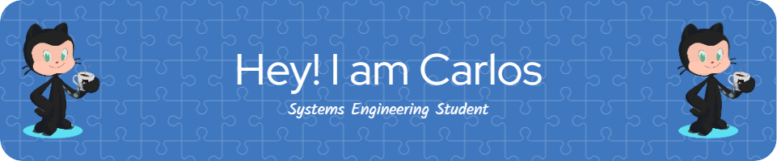

# Hello World! 👋

I'm **Carlos**, a passionate and dedicated student from **Perú** 🇵🇪, always eager to learn and innovate in the world of technology.

---

## 🚀 Skills & Technologies

  
  
  
  
  

✨ **Microservices Architecture** - Building scalable and resilient systems that can stand the test of time.

✨ **Backend Mastery** - Proficient in **Java** and **Spring Boot**, creating powerful and efficient backend services.

✨ **Frontend Aficionado** - Crafting interactive and dynamic user interfaces with **Angular**.

✨ **Expanding Horizons** - Currently diving into **Flutter** and **Python** to broaden my tech toolkit.

---

## 🌱 What I’m Up To

- 🔭 Exploring the realms of mobile app development with **Flutter**.
- 🌐 Contributing to open-source projects and sharing my journey on GitHub.
- 📚 Continuously learning and staying updated with the latest industry trends.

---

## 📫 Let's Connect

  
  
  

---

## 🎯 Fun Fact

> **"I’m always on the lookout for new challenges that push my boundaries. If there's a problem to solve, count me in!"**

---

   
  <strong>Thanks for stopping by! Let's build something amazing together.</strong>
   
  

